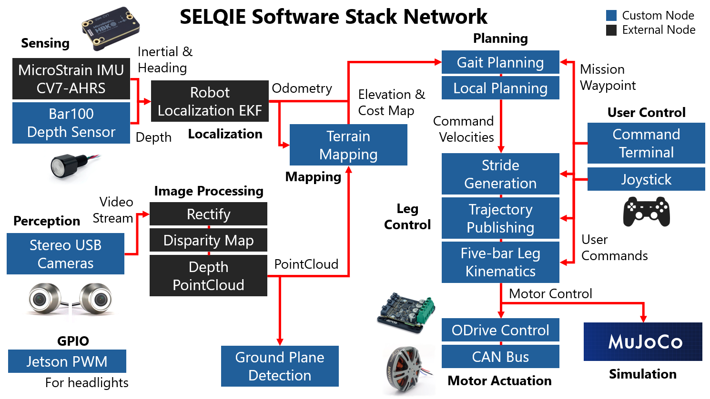

# SELQIE Robotic Software

|       Maintainer      |         E-mail           |
| --------------------- | ------------------------ |
| Jonathan Tyler Boylan | jtylerboylan@outlook.com |



## Packages

### [SELQIE Robot](./selqie_ros2/)
### [Bar100 Depth Sensor](./bar100_ros2/)
#### Requirements
##### Install Apt Packages
```
sudo apt-get install python3-smbus
```
##### Install Bar100 Python Package
```
git clone https://github.com/bluerobotics/KellerLD-python ~/.KellerLD
cd ~/.KellerLD && python3 setup.py install --user
```

#### Bar100 Node

##### Publishers

| Topic | Message Type | Description |
| ----- | ------------ | ----------- |
| `/bar100/depth` | `std_msgs/Float32` | Sensor depth reading |
| `/bar100/temperature` | `std_msgs/Float32` | Sensor temperature reading |

##### Parameters

| Parameter | Type | Default Value | Description |
| --------- | ---- | ------------- | ----------- |
| `i2c_bus` | `int` | `1` | I2C bus ID |
| `frequency` | `double` | `20.0` | Sensor publish frequency (in Hz) |
| `fluid_density` | `double` | `997.0474` | Density of the surrounding fluid (kg/m^3)|
| `gravity` | `double` | `9.80665` | Gravity (m/s^2) |
| `surface_pressure` | `double` | `1.0` | Pressure at the surface (bar) |

#### Depth2Pose Node

Converts depth reading from Bar100 Node to a Pose with covariance. Used for EKF fusion in the `robot_localization` package.

##### Publishers

| Topic | Message Type | Description |
| ----- | ------------ | ----------- |
| `/bar100/pose` | `geometry_msgs/PoseWithCovarianceStamped` | Output pose with covariance |

##### Subscribers

| Topic | Message Type | Description |
| ----- | ------------ | ----------- |
| `/bar100/depth` | `std_msgs/Float32` | Input depth reading |

##### Parameters

| Parameter | Type | Default Value | Description |
| --------- | ---- | ------------- | ----------- |
| `frame_id` | `string` | `"odom"` | Frame of the depth reading |
| `z_variance` | `double` | `2.89` | Depth sensor variance |

### [Stereo USB Cameras](./stereo_usb_cam/)
### [Jetson GPIO](./jetson_ros2/)
### [Terrain Mapping](./terrain_mapping/)
### [Ground Plane Detection](./ground_plane_detection/)
### [Gait Planning](./gait_planning/)
### [Local Planning](./local_planning/)
### [Stride Generation 2D](./stride_maker/)
### [Legged MPC 3D](./legged_mpc/)
### [Leg Kinematics](./leg_kinematics/)
### [ODrive Motor Controllers](./odrive_ros2/)
### [CAN Communication](./can_bus/)
### [MuJoCo Simulation](./mujoco_ros2/)
### [Robot Terminals](./robot_utils/)
### [Joystick Controllers](./robot_joysticks/)
### [Experiment Nodes](./robot_experiments/)
### [Unitree A1 Robot](./unitree_a1_mujoco/)

## Robot Terminals
Run these commands from `~/selqie_ws` to start a tmux terminal for a specific robot:
- SELQIE (Hardware): `./src/tmux/selqie.sh`
- SELQIE (Simulation): `./src/tmux/selqie_mujoco.sh`
- Unitree A1 (Simulation): `./src/tmux/unitree_a1.sh`

## Other Documentation

1. [Hardware Links for SELQIE](./docs/Hardware.md)
2. [Jetson AGX Flashing and Software Setup](./docs/JetsonAGX-Setup.md)

## Tools

1. [Configure an ODrive](./tools/configure_odrive.py)
2. [Flash the SELQIE Jetson](./tools/install.sh)
3. [Start the Jetson CAN Interfaces](./tools/loadcan_jetson.sh)