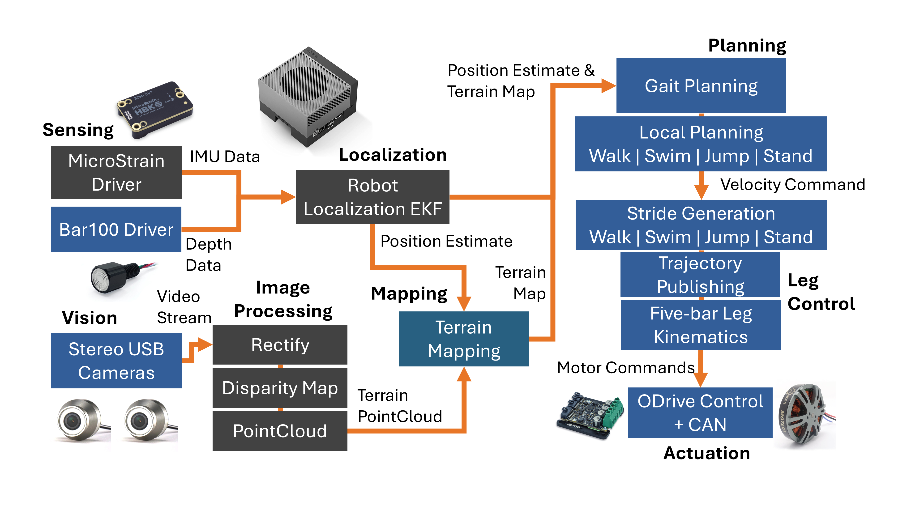

# SELQIE Robotic Software

*Originally written by Jonathan Boylan as part of his Master's Thesis*

|       Maintainer      |         E-mail           |
| --------------------- | ------------------------ |
| Jonathan Tyler Boylan | jtylerboylan@outlook.com |

SELQIE is an amphibious, legged-swimming robot. It uses four two-motor legs
(a five-bar linkage per leg, eight brushless motors total) to both **walk** on
the ground and **swim** through the water, and it can **jump** and **sink** to
transition between the two. All computation runs on-board an NVIDIA Jetson AGX
Orin using [ROS 2 Humble](https://docs.ros.org/en/humble/index.html).

> **Operators:** if your goal is to power on, connect to, and run the robot
> (not to modify the code), start with the
> **[SELQIE Standard Operating Procedure](docs/SELQIE_SOP.md)**. It is written
> for readers who are new to Linux and to SELQIE.

## Autonomy Stack


The software is a graph of ROS 2 nodes grouped into subsystems. Data flows from
the sensors, through localization and mapping, into the planners, and finally
down to the legs and motors:

```
Sensing ─┐
         ├─▶ Localization (EKF) ─▶ Planning ─▶ Leg Control ─▶ Actuation ─▶ Motors
Vision ──┴─▶ Mapping ───────────▶ (gait +      (stride +      (ODrive
                                   local)       kinematics)     over CAN)
```

- **Sensing** — MicroStrain 3DM-CV7 IMU (orientation) and Bar100 depth sensor.
- **Vision** — Stereo ExploreHD cameras → rectification → disparity → point cloud.
- **Localization** — `robot_localization` EKF fuses IMU, depth, and (optional)
  visual marker poses into a single odometry estimate.
- **Mapping** — Terrain mapping builds a `grid_map` elevation map from the
  camera point cloud.
- **Planning** — Gait planning (SBMPO graph search) picks *how* to move;
  local planning produces velocity commands for the active gait
  (walk / swim / jump / stand / sink).
- **Leg Control** — Stride generation turns velocity commands into per-leg foot
  trajectories; five-bar kinematics converts foot positions/forces into the two
  motor angles/torques for each leg.
- **Actuation** — The ODrive control nodes translate motor commands to/from
  ODrive Pro controllers over two CAN buses.

## SELQIE Platform


| Component | Part | Role |
| --------- | ---- | ---- |
| Onboard computer | NVIDIA Jetson AGX Orin 64 GB Developer Kit | Runs all ROS 2 software (host name `selqie`, often called *"the Orin"*) |
| Motors | 8 × mjbots MJ5208 brushless motors | 2 per leg, drive the five-bar linkages (gear ratio 6.0) |
| Motor controllers | 8 × ODrive Pro | Closed-loop control of each motor, commanded over CAN |
| IMU | MicroStrain 3DM-CV7-AHRS | Orientation / angular rate / acceleration |
| Depth sensor | Blue Robotics Bar100 | Water pressure → depth |
| Cameras | 2 × ExploreHD 3.0 underwater cameras | Stereo vision |
| Lights | Lumen Subsea Lights | Illumination (PWM brightness control) |
| Leak sensors | 3 × leak probes (front, rear, body) | Trigger an automatic Orin shutdown if water is detected |

### Legs, motors and CAN buses

SELQIE has four legs, each named by its corner of the body. Each leg is a
five-bar linkage driven by two motors, and the eight motors are split across two
CAN buses:

| Leg | Name | Motors | CAN bus | Hip location (x, y) [m] |
| --- | ---- | ------ | ------- | ----------------------- |
| Front-Left  | `FL` | 0, 1 | `can0` | (+0.3, +0.125) |
| Rear-Left   | `RL` | 2, 3 | `can0` | (−0.3, +0.125) |
| Rear-Right  | `RR` | 4, 5 | `can1` | (−0.3, −0.125) |
| Front-Right | `FR` | 6, 7 | `can1` | (+0.3, −0.125) |

## Repository layout

This repository is a ROS 2 workspace `src` folder. Cloning it into
`~/selqie_ws/src` produces the workspace layout the tooling expects.

| Directory | Contents |
| --------- | -------- |
| `actuation/` | CAN bus node, ODrive control node, and actuation messages (`MotorCommand`, `MotorConfig`, `MotorEstimate`, `MotorInfo`, `CanFrame`) |
| `leg_control/` | Five-bar leg kinematics, leg trajectory publisher, stride generation, feed-forward gait trajectory files (`walk/jump/crawl/swim.txt`) |
| `localization/` | `robot_localization` EKF configuration and AR-marker localization |
| `mapping/` | Terrain (elevation) mapping node |
| `planning/` | Gait planning and local planning (SBMPO-based) |
| `mpc/` | Convex (OSQP) legged model-predictive controller and its support nodes |
| `sensing/` | Bar100 depth driver, IMU (MicroStrain) launch, IMU calibration node |
| `vision/` | Stereo USB camera driver, stereo image processing, point-cloud RGB filter |
| `jetson/` | Jetson GPIO node (lights, leak inputs) and Jetson status (`jtop`) publisher |
| `simulation/` | MuJoCo simulator bridge and the SELQIE robot model |
| `ui/` | `selqie_terminal` (the operator console), joint-state publisher, viewer tools |
| `selqie_bringup/` | Top-level launch files that compose all subsystems |
| `tmux/` | `selqie.sh` / `selqie_mujoco.sh` — the scripts operators run to start everything |
| `tools/` | Install script, CAN/GPIO/udev setup, ODrive configuration script |
| `matlab/` | MATLAB helpers for kinematics, ROS bag parsing, and stride visualization |
| `docs/` | Standard Operating Procedure and Jetson setup guide |

## Getting started

### Prerequisites
- **Robot / production:** NVIDIA Jetson AGX Orin running JetPack 6.1.
- **Development / simulation:** Ubuntu 22.04 (x86-64).
- ROS 2 Humble (installed by the script below).

Detailed Jetson flashing and first-time setup steps are in
[`docs/JetsonAGX-Setup.md`](docs/JetsonAGX-Setup.md).

### Install and build

Clone this repository into a workspace `src` folder and run the install script.
It installs ROS 2 Humble and all dependencies (OSQP, SBMPO, KellerLD, MuJoCo on
dev machines, etc.), builds the workspace with `colcon`, and sources ROS 2 in
your `.bashrc`.

```bash
mkdir -p ~/selqie_ws
git clone git@github.com:FAMU-FSU-STRIDe/selqie ~/selqie_ws/src
cd ~/selqie_ws/src/tools

# On the Jetson (robot):
./install.sh

# On a development / simulation computer (Ubuntu 22.04):
./install.sh --devel
```

To rebuild after changing code:

```bash
cd ~/selqie_ws
colcon build --symlink-install
source install/setup.bash
```

## Running the robot

The normal way to start SELQIE is the tmux launch script, which opens a 2×2
terminal layout with the hardware bringup, the operator console, a spare shell,
and the Jetson stats monitor:

```bash
cd ~/selqie_ws/src/tmux
./selqie.sh
```

The top-right pane is the **SELQIE terminal** — an interactive console
(`ros2 run selqie_ui selqie_terminal`) used to command the robot.

> **Full operating procedure (power-on order, safety, connecting over SSH, and
> running a test) is documented step-by-step in
> [docs/SELQIE_SOP.md](docs/SELQIE_SOP.md).**

### Simulation

To run the same stack against the MuJoCo simulator instead of hardware (dev
machine only), use:

```bash
cd ~/selqie_ws/src/tmux
./selqie_mujoco.sh
```

## SELQIE terminal command reference

These commands are typed at the `SELQIE>` prompt in the operator console. Type
`help` or `?` to list them, or `help <command>` for details.

**Motor & leg setup**

| Command | Description |
| ------- | ----------- |
| `ready` | Put all motors into closed-loop control (energized/holding) |
| `idle` | Release all motors (de-energized/free) |
| `zero` | Command every motor to position 0 (used with the zeroing guides) |
| `clear_errors` | Clear ODrive errors on all motors |
| `default` | Apply default motor gains and default (stance) leg positions |
| `set_gains <p> <v> <vi>` | Set position/velocity/velocity-integrator gains on all motors |
| `set_motor_position <motor> <pos>` | Command a single motor to a position (radians) |
| `set_leg_position <leg/*> <x> <y> <z>` | Command a leg's foot position (meters) |
| `set_leg_force <leg/*> <x> <y> <z>` | Command a leg's foot force (newtons) |

**Feed-forward trajectories** (open-loop gait playback)

| Command | Description |
| ------- | ----------- |
| `run_trajectory <file> <loops> <hz>` | Play a trajectory file (`walk.txt`, `jump.txt`, `crawl.txt`, `swim.txt`) for N loops at a given rate |

**Closed-loop gaits** (planner/stride driven)

| Command | Description |
| ------- | ----------- |
| `set_gait <walk\|swim\|jump\|sink\|stand\|none>` | Select the active gait |
| `cmd_vel <lin_x> <lin_z> <ang_z>` | Publish a velocity command for the active gait |
| `walk <lin_x> <ang_z>` | Shortcut: set walk gait and drive |
| `swim <lin_x> <lin_z>` | Shortcut: set swim gait and drive |
| `jump <lin_x> <lin_z>` | Shortcut: set jump gait |
| `stand` / `sink` | Shortcut: stand in place / sink |
| `set_goal <x> <y> <theta>` | Send an autonomous goal pose to the planner |

**Data, sensors & utilities**

| Command | Description |
| ------- | ----------- |
| `start_recording` / `stop_recording` | Start/stop a ROS bag of all key topics (saved to `/home/selqie/rosbags/<timestamp>`) |
| `print_motor_info` / `print_leg_info` | Print live motor / leg telemetry |
| `print_errors` | Print any active motor errors |
| `set_light_brightness <0-100>` | Set the subsea light brightness |
| `calibrate_imu` | Calibrate the IMU (hold the robot still) |
| `reset_localization` | Reset the pose estimate to the origin |
| `reset_map` | Clear the terrain map |
| `exit` | Leave the terminal and shut down its ROS node |

## Documentation

- **[SELQIE Standard Operating Procedure](docs/SELQIE_SOP.md)** — operator guide:
  safety, power-on/off, connecting, and running a test.
- **[Jetson AGX Orin Setup](docs/JetsonAGX-Setup.md)** — flashing and first-time
  software install.
- Subsystem notes live next to the code they describe, e.g.
  [`actuation/can_bus/README.md`](actuation/can_bus/README.md),
  [`actuation/odrive_control/README.md`](actuation/odrive_control/README.md),
  [`sensing/bar100_driver/README.md`](sensing/bar100_driver/README.md),
  [`vision/README.md`](vision/README.md), and
  [`planning/gait_planning/README.md`](planning/gait_planning/README.md).
