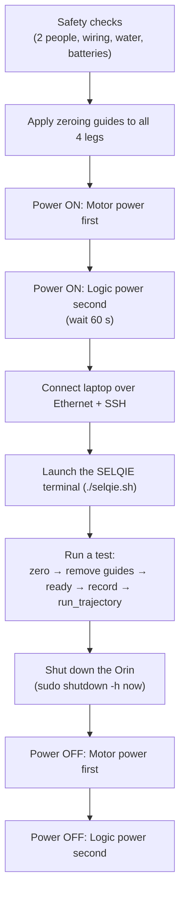
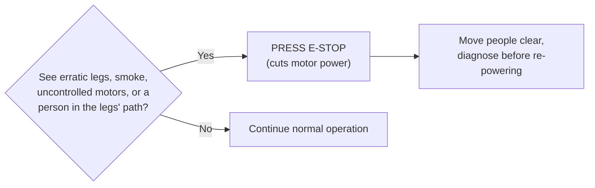
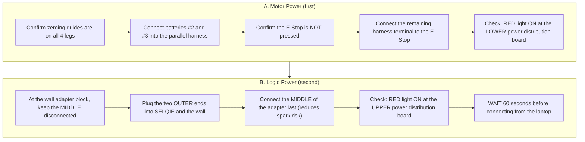
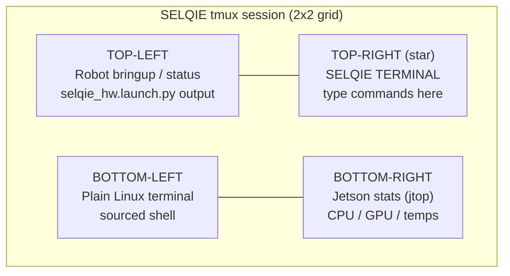
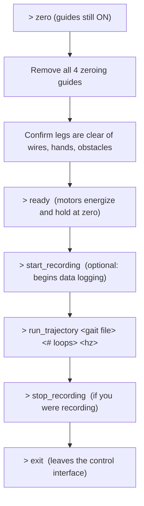
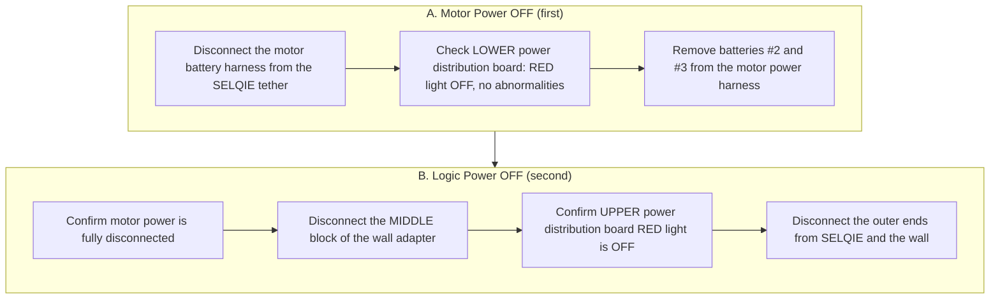
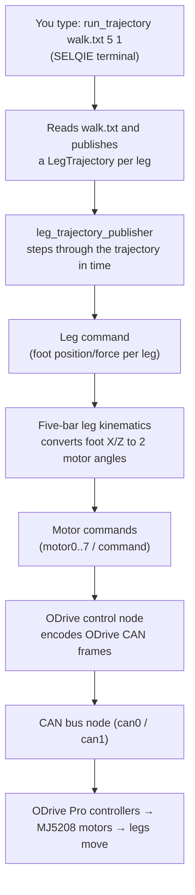

# SELQIE — Standard Operating Procedure

**Version 2.0 (expanded)**
Based on the original SOP V1.0, created June 4th 2025 by Ryan Kaczmarczyk (last
modified June 26th 2025). For use with `selqie_ws` version 3.0.

> This expanded edition keeps every step from the original operating procedure
> and adds explanations, diagrams, a command reference, troubleshooting, and a
> glossary so that **someone with little familiarity with Linux or SELQIE can
> safely power on, connect to, and operate the robot.** Words in **bold-italic**
> the first time they appear (e.g. ***SSH***, ***ROS 2***) are defined in the
> [Glossary](#glossary-of-terms).
>
> The original SOP referenced photographs labelled *Figure 1–9*. Those photos
> live in the original SOP, kept alongside this file at
> `docs/SELQIE_SOP_original.pdf`. Where a photo is important, this document
> points you to it, e.g. *(see Figure 2 in the original SOP)*.

---

## How to use this document

- **First time operating SELQIE?** Read the whole thing once, top to bottom.
- **Already trained?** Jump to the [One-Page Checklist](#one-page-operators-checklist)
  and the [Terminal Command Reference](#selqie-terminal-command-reference).
- **Something went wrong?** Go to [Troubleshooting](#troubleshooting).

⚠️ **Golden rule: two trained people must always be present** for powering,
operating, and testing SELQIE. One person watches the robot and the emergency
stop; the other works the laptop.

---

## Table of Contents

1. [System Overview at a Glance](#1-system-overview-at-a-glance)
2. [The Operating Lifecycle](#2-the-operating-lifecycle)
3. [Safety Notes](#3-safety-notes)
   - [Batteries](#31-batteries)
   - [Emergency Stop (E-Stop)](#32-emergency-stop-e-stop)
   - [Wiring](#33-wiring)
   - [Water & Leak Sensors](#34-water--leak-sensors)
4. [Computer & Linux Basics (read this before connecting)](#4-computer--linux-basics)
5. [Testing Procedure](#5-testing-procedure)
   - [Step 1 — Apply the Zero Guides](#step-1--apply-the-zero-guides)
   - [Step 2 — Power On SELQIE](#step-2--power-on-selqie)
   - [Step 3 — Connect to SELQIE](#step-3--connect-to-selqie)
   - [Step 4 — Launch the SELQIE Terminal](#step-4--launch-the-selqie-terminal)
   - [Step 5 — Run a Test](#step-5--run-a-test)
6. [Shutting Down the Orin](#6-shutting-down-the-orin)
7. [Powering Off SELQIE](#7-powering-off-selqie)
8. [One-Page Operator's Checklist](#one-page-operators-checklist)
9. [SELQIE Terminal Command Reference](#selqie-terminal-command-reference)
10. [Troubleshooting](#troubleshooting)
11. [Glossary of Terms](#glossary-of-terms)
12. [Appendix — How a Command Reaches a Motor](#appendix--how-a-command-reaches-a-motor)

---

## 1. System Overview at a Glance

SELQIE is an **amphibious, legged-swimming robot**: it walks on land and swims
underwater using four legs. Each leg is a *five-bar linkage* driven by **two
motors**, for **eight motors total**. A single onboard computer runs all of the
software.

You will interact with these major parts:

| Part | What it is | Why you care |
| ---- | ---------- | ------------ |
| **The Orin** | An NVIDIA Jetson AGX Orin — SELQIE's onboard computer. Its ***host name*** is `selqie`. | You connect to it from the laptop to run everything. |
| **Motors & legs** | 8 brushless motors (mjbots MJ5208) driven by 8 ODrive Pro controllers, arranged as 4 two-motor legs. | These are the moving parts. Keep hands clear. |
| **Motor power** | Batteries **#2** and **#3** feeding the motors through a harness and the **E-Stop**. | Powers the muscles. Connected/disconnected first at power-off. |
| **Logic power** | A wall adapter that powers the Orin and electronics. | Powers the brain. Connected last, disconnected last. |
| **Sensors** | IMU (orientation), Bar100 (depth), stereo cameras, leak sensors. | Feed the robot's sense of where it is and whether it's flooding. |
| **The laptop** | Your control station, connected by an Ethernet ***tether***. | Where you type commands. |

The four legs are named by their corner of the body:

| Leg | Name | Motors | CAN bus |
| --- | ---- | ------ | ------- |
| Front-Left  | `FL` | 0, 1 | `can0` |
| Rear-Left   | `RL` | 2, 3 | `can0` |
| Rear-Right  | `RR` | 4, 5 | `can1` |
| Front-Right | `FR` | 6, 7 | `can1` |

---

## 2. The Operating Lifecycle

Every session follows the same top-level sequence. **The power-on order and the
power-off order are the reverse of each other**, and both matter for safety.



Keep this picture in mind; the rest of the document walks through each block.

---

## 3. Safety Notes

> **Two people must always be present for the powering, operation, and testing of
> SELQIE.** No exceptions.

### 3.1 Batteries

- The batteries that run SELQIE's **motors** are labelled **#2** and **#3**
  *(see Figure 1 in the original SOP)*.
- During operation they are connected **in parallel** through the motor-power
  harness.
- **During storage they must be removed from the parallel connection harness.**
  Never store the pack wired together.
- Inspect batteries for swelling, damage, or low voltage before use. A damaged
  lithium battery is a fire hazard — do not use it.

### 3.2 Emergency Stop (E-Stop)

The motor-power connection includes an **emergency stop (E-Stop) button**
*(see Figure 2 in the original SOP)*. Pressing it **cuts power to the motors**.

**Press the E-Stop immediately** if you see any concerning electrical or motor
behavior, including but not limited to:

- erratic or uncommanded leg movement,
- smoke or a burning smell,
- motors running uncontrollably,
- **any person or object inside the legs' range of motion.**

Know where the E-Stop is *before* you apply power, and make sure the person
watching the robot can reach it at all times.



### 3.3 Wiring

**Always inspect wiring before connecting SELQIE to power.** Check for:

- loose connections,
- dismounted or dangling electrical components,
- unintended contact of bare metal.

The **3.3 V / Ground Bus** *(see Figure 3 in the original SOP)* should have all female
headers fully seated in the housing.

> **If you are not 100 % confident the wiring looks correct, ask a second person
> to check behind you. If any suspicion remains, do not power SELQIE.**

### 3.4 Water & Leak Sensors

Because SELQIE is an aquatic robot, **inspect it for water intrusion before
powering** and after any time in the water:

- Visually check the main body.
- **Listen** to each hip enclosure for sloshing/water.
- If you suspect water anywhere, get a second opinion before powering.

**Automatic leak protection.** SELQIE has three leak sensors — one in each hip
region and one in the main body — wired to the Orin's GPIO pins:

| Location | Where | Signal pin |
| -------- | ----- | ---------- |
| Rear | rear hip enclosure area | header 35 |
| Front | front hip enclosure area | header 22 |
| Body | main body | header 38 |

A background service on the Orin (`water_shutdown.py`) polls these sensors once
per second. **If any sensor detects water, the Orin automatically runs a
shutdown** and logs the event to `/var/log/water_shutdown.log`.

> ⚠️ **If the Orin shuts down unexpectedly at any time, assume a leak.**
> Immediately disconnect power (motor power first, then logic power — see
> [Section 7](#7-powering-off-selqie)) and, if applicable, retrieve SELQIE from
> the water.

---

## 4. Computer & Linux Basics

*(Skip this section if you are comfortable with a Linux terminal and SSH.)*

You will control SELQIE from the **SELQIE laptop** by typing text commands into a
**terminal**. A few conventions used in this document:

- Lines that start with `>` are commands **you type**, then press **Enter**.
  Do **not** type the `>` itself. Example:

  ```
  > ssh selqie
  ```
  means: type `ssh selqie` and press Enter.

- ***SSH*** (Secure Shell) is how the laptop "logs in" to the Orin over the
  Ethernet cable so that commands you type run *on the robot's computer*, not on
  the laptop.
- ***sudo*** means "run this as the administrator." It will ask for a password.
- A ***password prompt*** does **not** show characters as you type — this is
  normal. Type the password and press Enter.
- The password for `ssh selqie` and for `sudo` is **the lab password** (the same
  one used elsewhere on SELQIE). It is intentionally **not** written in this
  repository — ask a lab member if you don't have it.
- Copy/paste in most Linux terminals is **Ctrl+Shift+C / Ctrl+Shift+V**
  (not Ctrl+C — inside a terminal, Ctrl+C *stops the running program*).

Two more terms you'll see constantly:

- ***ROS 2*** — the "Robot Operating System," the software framework SELQIE runs
  on. It is organized as many small programs (***nodes***) that pass messages on
  named channels (***topics***). You don't need to manage these directly; the
  launch script starts them for you.
- ***tmux*** — a tool that splits one terminal window into several panes so you
  can see the robot's status, the control console, and system stats at once.

---

## 5. Testing Procedure

SELQIE must be powered on in a **specific order**. Follow these five steps in
sequence.

### Step 1 — Apply the Zero Guides

Before powering, attach the **green zeroing guides (blocks)** to each of the four
legs *(see Figure 5 in the original SOP)*.

- They clip over each leg, attaching to the **top and bottom of each hip**.
- They should seat **comfortably, without much force**. If you have to force it,
  stop and check the leg position.
- **Orientation:** the side of each guide with the **deeper groove** goes over
  the **outermost** side of the leg's linkage.

**Why:** the guides hold each leg in its exact mechanical "zero" pose. When the
motors are later energized (the `ready` command), they will already be sitting at
zero and will not jump to an unexpected position.

> Do this for **all four legs** (`FL`, `RL`, `RR`, `FR`) before applying power.

### Step 2 — Power On SELQIE

**Order matters: motor power first, then logic power.**



#### 2A. Motor Power

1. With the **zeroing guides applied**, connect batteries **#2 & #3** into the
   parallel connection harness *(see Figure 6 in the original SOP)*.
2. Ensure the **E-Stop is not activated** (not pressed in).
3. Connect the remaining harness terminal to the **E-Stop** *(see Figure 7)*.
4. A **red light** should appear on the **lower** power distribution board.
   Inspect it for any abnormal behavior (flickering, other colors, heat, smell).

#### 2B. Logic Power

SELQIE's logic circuit is powered from the **designated wall power adapter** at
the ONR Project Desk *(see Figure 8 in the original SOP)*.

1. At the adapter block, **disconnect the middle** (wall-side) portion of the
   cable.
2. Keeping the middle disconnected, plug the **two outer ends** into **SELQIE**
   and the **wall**.
3. **Connect the middle portion last.** This sequence minimizes spark risk.
4. A **red light** should now appear on the **upper** power distribution board.
   Inspect it for abnormal behavior.
5. **Wait 60 seconds** before connecting to SELQIE from the laptop (this gives
   the Orin time to boot).

### Step 3 — Connect to SELQIE

1. Connect the Ethernet ***tether*** to the laptop using the **USB-C to Ethernet
   adapter** *(see Figure 9 in the original SOP)*.
2. **Protect the tether.** Do not put unnecessary stress on it — you may need to
   tape the **non-SELQIE** side down to your work surface.
3. Open a terminal on the SELQIE laptop and log in to the Orin over ***SSH***:

   ```
   > ssh selqie
   ```

4. When prompted, enter the **lab password** (characters won't appear as you
   type — that's normal; ask a lab member if you don't have it).

You are now inside SELQIE's home directory on the Orin. Everything you type from
here runs **on the robot**.

> **First-time only:** SSH may ask *"Are you sure you want to continue
> connecting (yes/no)?"* — type `yes` and press Enter.

### Step 4 — Launch the SELQIE Terminal

1. Navigate to the `tmux` folder of the workspace:

   ```
   > cd selqie_ws/src/tmux
   ```

2. Start the environment:

   ```
   > ./selqie.sh
   ```

This opens a ***tmux*** session split into a **2×2 grid** of panes. Each pane is
started for you automatically:



| Pane | Contents | You use it to… |
| ---- | -------- | -------------- |
| **Top-left** | The hardware bringup launch (`selqie_hw.launch.py`). Scrolling **status updates** appear here. | Watch that nodes start without red errors. |
| **Top-right** ★ | **The SELQIE terminal** — the control console. Its prompt is `SELQIE>`. | **Type all robot commands here.** |
| **Bottom-left** | A standard Linux terminal, already "sourced" for ROS 2. | Run extra commands (e.g. shutdown). |
| **Bottom-right** | The **Jetson stats** monitor (`jtop`). | Watch CPU/GPU load and temperatures. |

Useful tmux tips:
- **Mouse is enabled** — click a pane to select it, scroll to see history.
- To move between panes with the keyboard: **Ctrl+b** then an arrow key.
- To close the whole session safely later, press **Ctrl+b** then **x** (this is
  configured to send a stop signal to every pane before closing).

### Step 5 — Run a Test

All commands below are typed into the **SELQIE terminal (top-right pane)** at the
`SELQIE>` prompt. Type `help` or `?` at any time to list commands.



**1. Zero the motors — with the guides still on.**

```
> zero
```
This commands every motor to position 0. Because the guides physically hold the
legs at zero, nothing should move.

**2. Remove the zeroing guides** from all four legs. Then **confirm the legs are
clear** of wires, tools, hands, and obstacles.

**3. Ready the motors.**

```
> ready
```
This puts all motors into **closed-loop control** — they energize and actively
hold the zero (stance) position. **Keep hands clear from this point on.** The
legs are now "live."

**4. (Optional) Start data recording.**

```
> start_recording
```
This launches a ***ROS bag*** recording of all relevant topics (motor and leg
telemetry, camera images, IMU, depth, commands, odometry, etc.). Recordings are
named with the date/time they started and saved on the Orin under:

```
/home/selqie/rosbags/<YYYY-MM-DD-HH-MM-SS>
```

> **Note:** the original SOP listed the path as `/home/rosbags/`. The current
> software saves to **`/home/selqie/rosbags/`** (i.e. inside the `selqie` user's
> home directory). Use that path when retrieving data.

**5. Run a feed-forward trajectory.** The legs are in the stance position; this
plays a pre-recorded gait "open loop" (feed-forward).

```
> run_trajectory <gait file> <# of loops> <hz>
```

- `<gait file>` — one of: **`walk.txt`**, **`jump.txt`**, **`crawl.txt`**,
  **`swim.txt`**.
- `<# of loops>` — how many times to repeat the trajectory (whole number).
- `<hz>` — playback rate in hertz; higher = faster/more aggressive.

Example — walk in place for 5 loops at 1 Hz:

```
> run_trajectory walk.txt 5 1
```

> **Start conservative.** For a first run on a new gait, use a **low loop count**
> and a **low frequency**, keep a hand near the E-Stop, and watch for erratic
> motion.

**6. Stop data recording** (if you started it):

```
> stop_recording
```

**7. Exit the control interface** when finished:

```
> exit
```

This releases the terminal's connection to the robot. The legs will de-energize
when the underlying nodes stop.

---

## 6. Shutting Down the Orin

Before removing power, **cleanly shut down the Orin's computer** so nothing is
corrupted. In a terminal window (the **bottom-left** pane works well), run:

```
> sudo shutdown -h now
```

Enter the **lab password** when prompted.

Wait for the Orin to finish powering down (its indicator lights/fans go quiet)
before removing logic power.

---

## 7. Powering Off SELQIE

**Order matters — this is the reverse of power-on: motor power off first, then
logic power off.**



1. **Motor power first.** Disconnect the motor battery harness from the SELQIE
   tether. Inspect the **lower** power distribution board — the **red light
   should be off** and nothing should look abnormal.
2. Remove the **individual batteries** (#2 & #3) from the motor power harness.
   *(Remember: batteries are stored out of the parallel harness — see
   [Batteries](#31-batteries).)*
3. **After confirming motor power is disconnected,** disconnect the logic power
   source (wall power) at the **middle block**. The **upper** power distribution
   board's red light should go off.
4. Disconnect the outer ends of the cord from **SELQIE** and the **wall**.

---

## One-Page Operator's Checklist

> Print this. Two people, always.

**Power ON**
- [ ] 2 trained people present; E-Stop located and reachable
- [ ] Wiring inspected (no loose/bare/dismounted connections; 3.3 V bus seated)
- [ ] No water in body or hips (look + listen)
- [ ] Zeroing guides on **all 4 legs** (deep groove outboard)
- [ ] **Motor power:** batteries #2 & #3 → harness → E-Stop not pressed → connect E-Stop → **lower** board red light OK
- [ ] **Logic power:** middle disconnected → plug outer ends → connect middle last → **upper** board red light OK
- [ ] **Wait 60 s**

**Connect & Launch**
- [ ] Ethernet tether to laptop via USB-C adapter (tether strain-relieved)
- [ ] `ssh selqie` → lab password
- [ ] `cd selqie_ws/src/tmux` → `./selqie.sh`
- [ ] Top-left pane shows nodes starting without red errors

**Run a Test** *(SELQIE terminal, top-right)*
- [ ] `zero` (guides still on)
- [ ] Remove guides; legs clear of everything
- [ ] `ready` (hands clear — legs are live)
- [ ] `start_recording` (optional)
- [ ] `run_trajectory <walk|jump|crawl|swim>.txt <loops> <hz>` (start low!)
- [ ] `stop_recording` (if recording)
- [ ] `exit`

**Power OFF**
- [ ] `sudo shutdown -h now` → wait for Orin to power down
- [ ] **Motor power off first:** harness off → lower board red light off → remove batteries
- [ ] **Logic power off second:** middle block off → upper board red light off → unplug outer ends
- [ ] Batteries removed from parallel harness for storage

---

## SELQIE Terminal Command Reference

Every command below is typed at the `SELQIE>` prompt. Type `help` to list them
or `help <command>` for details. **Bold** commands are the ones used in the
standard test procedure.

### Motor & leg setup

| Command | What it does |
| ------- | ------------ |
| **`zero`** | Command all 8 motors to position 0 (used with the zeroing guides). |
| **`ready`** | Put all motors into **closed-loop control** — energized and holding. Legs go "live." |
| `idle` | Release all motors (de-energized, free to move by hand). |
| `clear_errors` | Clear ODrive faults on all motors. |
| `default` | Apply default motor gains and default stance leg positions. |
| `set_gains <p> <v> <vi>` | Set position / velocity / velocity-integrator gains on all motors. |
| `set_motor_position <motor> <pos>` | Move a single motor (0–7) to a position in radians. |
| `set_leg_position <leg/*> <x> <y> <z>` | Command a leg's foot position in meters (`leg` = `FL`/`RL`/`RR`/`FR`, or `*` for all). |
| `set_leg_force <leg/*> <x> <y> <z>` | Command a leg's foot force in newtons. |
| `print_motor_info` | Print live telemetry for every motor (position, velocity, torque, voltage, temperature, errors). |
| `print_leg_info` | Print live position/velocity/force estimate for every leg. |
| `print_errors` | List any active motor errors by name. |

### Feed-forward trajectories (open-loop gait playback)

| Command | What it does |
| ------- | ------------ |
| **`run_trajectory <file> <loops> <hz>`** | Play a trajectory file (`walk.txt`, `jump.txt`, `crawl.txt`, `swim.txt`) for a number of loops at a given rate. |

### Closed-loop gaits (planner / stride driven)

These use the full planning + stride-generation stack rather than a fixed file.

| Command | What it does |
| ------- | ------------ |
| `set_gait <walk\|swim\|jump\|sink\|stand\|none>` | Select the active gait mode. |
| `cmd_vel <lin_x> <lin_z> <ang_z>` | Send a velocity command to the active gait. |
| `walk <lin_x> <ang_z>` | Shortcut: switch to walk and drive. |
| `swim <lin_x> <lin_z>` | Shortcut: switch to swim and drive. |
| `jump <lin_x> <lin_z>` | Shortcut: switch to jump. |
| `stand` / `sink` | Shortcut: stand in place / sink. |
| `set_goal <x> <y> <theta>` | Send an autonomous goal pose to the planner. |

### Data, sensors & utilities

| Command | What it does |
| ------- | ------------ |
| **`start_recording`** / **`stop_recording`** | Start/stop a ROS bag of key topics → `/home/selqie/rosbags/<timestamp>`. |
| `set_light_brightness <0-100>` | Set the subsea light brightness (percent). |
| `calibrate_imu` | Calibrate the IMU — hold the robot still while it runs. |
| `reset_localization` | Reset the pose estimate to the origin. |
| `reset_map` | Clear the terrain map. |
| **`exit`** | Leave the terminal and shut down its ROS node. |

---

## Troubleshooting

| Symptom | Likely cause / what to do |
| ------- | ------------------------- |
| **Orin shut down by itself** | **Treat as a leak.** Disconnect power (motor first, then logic) and, if applicable, retrieve SELQIE from the water. Check `/var/log/water_shutdown.log` on the Orin after re-powering. |
| **`ssh selqie` fails / times out** | Check the Ethernet tether and USB-C adapter are seated; confirm you waited ~60 s after logic power; confirm the Orin actually booted (logic-power red light on). |
| **Password rejected** | Characters don't show while typing — that's normal. Re-type the lab password carefully. |
| **`run_trajectory`, `ready`, or `zero` produce no motion** | Motors may not be energized (run `ready` first) or in a fault state (run `print_errors`, then `clear_errors`). Also confirm **motor power** is on and the **E-Stop is not pressed**. In the current code, the **actuation** and **leg_control** launches are commented out in `selqie_bringup/launch/selqie_hw.launch.py`; if the motor/leg nodes are not running, a maintainer must enable those lines and rebuild before motion commands will work. |
| **Legs jump when I run `ready`** | The legs were not at zero. Press E-Stop, re-apply the zeroing guides, run `zero` again, then `ready`. |
| **Motors fault repeatedly (`print_errors` shows errors)** | Run `clear_errors`. If it persists, check CAN wiring and battery voltage; see `actuation/can_bus/README.md`. |
| **A leg moves the wrong direction** | Likely a motor/leg mapping or `flip_y` issue — this is a maintenance/config problem, not an operating one. Stop and consult a maintainer. |
| **Recording produced no file** | Confirm you ran `start_recording` *before* the motion and `stop_recording` after; look in `/home/selqie/rosbags/`. |
| **`jtop` pane shows very high temperature** | Reduce activity, ensure adequate cooling/water, and consider shutting down. |
| **Something looks wrong and you're unsure** | **Press the E-Stop and ask a second person.** When in doubt, power down. |

---

## Glossary of Terms

| Term | Definition |
| ---- | ---------- |
| **Amphibious** | Able to operate both on land and in water. SELQIE walks and swims. |
| **Bar100** | A Blue Robotics pressure sensor used to measure water depth. |
| **Brushless motor** | An efficient electric motor (here, mjbots MJ5208) with no brushes; driven by an electronic controller (the ODrive). |
| **CAN / CAN bus** | *Controller Area Network* — the wiring/protocol that carries commands between the Orin and the ODrive motor controllers. SELQIE uses two: `can0` and `can1`. |
| **Closed-loop control** | The motor actively senses its position and corrects to hold/track a target. The `ready` command puts motors in this state. |
| **E-Stop (Emergency Stop)** | A physical button that cuts motor power immediately. |
| **EKF (Extended Kalman Filter)** | The math that fuses IMU, depth, and other sensors into one best-guess estimate of the robot's position/orientation. |
| **Feed-forward / open-loop** | Playing a pre-planned motion (a trajectory file) without correcting from sensor feedback. `run_trajectory` is feed-forward. |
| **Five-bar linkage** | The two-motor leg mechanism SELQIE uses; two motor angles determine the foot's X/Z position. |
| **Gait** | A pattern of leg motion for locomotion: `walk`, `swim`, `jump`, `crawl`, `sink`, `stand`. |
| **GPIO** | *General-Purpose Input/Output* — the Orin's electrical pins used here for the lights (output) and leak sensors (input). |
| **Host name** | The network name of a computer. The Orin's host name is `selqie`, which is why you type `ssh selqie`. |
| **IMU** | *Inertial Measurement Unit* (MicroStrain 3DM-CV7) — measures orientation, rotation rate, and acceleration. |
| **jtop** | A monitor for NVIDIA Jetson boards showing CPU/GPU usage, temperature, and power (the bottom-right pane). |
| **Leak sensor** | A probe that detects water inside the robot; triggers an automatic Orin shutdown. |
| **Logic power** | The wall-adapter power that runs the Orin and electronics (the "brain"). |
| **Motor power** | The battery power (packs #2 & #3) that drives the motors (the "muscles"). |
| **Node** | A single ROS 2 program. Many nodes run at once to operate SELQIE. |
| **ODrive (ODrive Pro)** | The controller board that drives each brushless motor and reports its state over CAN. |
| **Orin** | The NVIDIA Jetson AGX Orin — SELQIE's onboard computer. |
| **Power distribution board** | A board that routes power; each has a red indicator light. "Lower" = motor power, "Upper" = logic power. |
| **ROS 2 (Robot Operating System 2)** | The software framework SELQIE runs on. SELQIE uses the *Humble* release. |
| **ROS bag** | A recorded file of ROS messages (telemetry, images, commands) captured with `start_recording` for later analysis. |
| **SBMPO** | *Sampling-Based Model Predictive Optimization* — the graph-search planner used for gait/path planning. |
| **SSH (Secure Shell)** | A secure way to log in to and run commands on the Orin from the laptop. |
| **`sudo`** | "Superuser do" — run a command with administrator privileges (asks for a password). |
| **Stance position** | The default standing pose of the legs (foot at z ≈ −0.189 m below the hip). |
| **Stride generation** | Software that turns a velocity command into per-leg foot trajectories for a gait. |
| **Tether** | The cable (Ethernet here) connecting SELQIE to the laptop. Protect it from strain. |
| **tmux** | A terminal multiplexer that splits one window into panes; the launch script uses a 2×2 layout. |
| **Topic** | A named channel that ROS 2 nodes use to publish/subscribe messages (e.g. `motor0/command`). |
| **Trajectory file** | A text file describing a sequence of leg commands over time (`walk.txt`, `jump.txt`, `crawl.txt`, `swim.txt`). |
| **Zeroing guides (blocks)** | Green clip-on blocks that hold each leg at its exact zero pose before the motors are energized. |

---

## Appendix — How a Command Reaches a Motor

For the curious: when you type `run_trajectory walk.txt 5 1`, here is the chain
of software that turns your keystrokes into leg motion. You don't need this to
operate SELQIE, but it helps when diagnosing "nothing moved."



If the legs don't move, the break is usually near the bottom of this chain:
motor power off, E-Stop pressed, motors not `ready`, motors in a fault state, or
the actuation/leg_control nodes not launched (see
[Troubleshooting](#troubleshooting)).

---

*End of Standard Operating Procedure. When in doubt, press the E-Stop, power down
in order, and ask a second person.*
